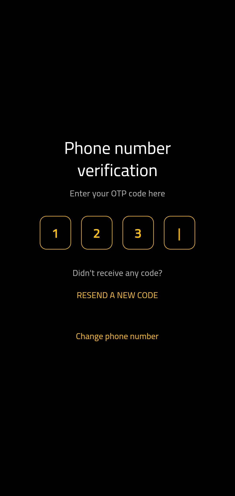
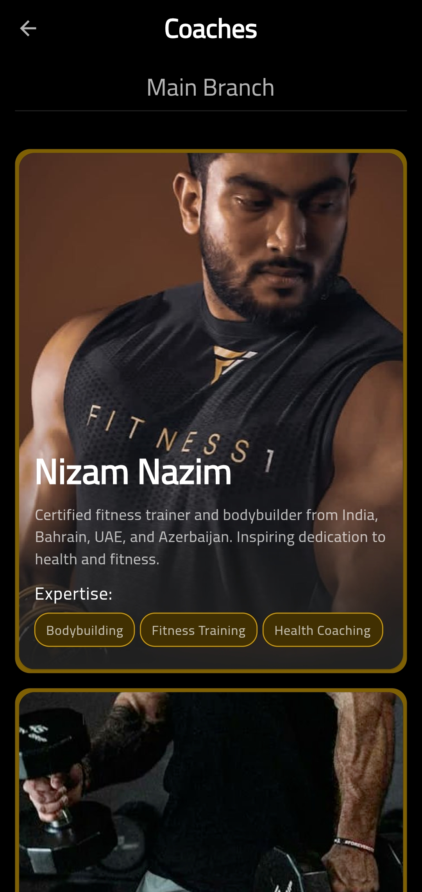

# Overview

A simple mobile app frontend for a gym branch called Fitness1

## Screenshots

## Features

Not yet added.

## Credits

The coach posts from Instagram.

## Disclaimer

This project isn't related to Fitness1 Gym.
